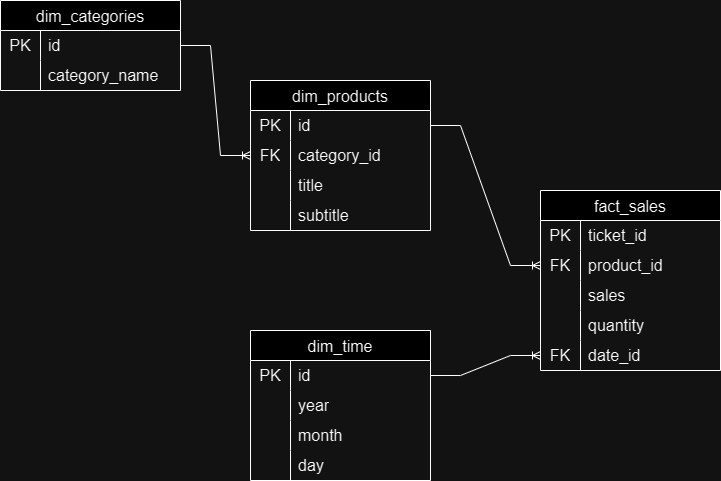

## Deliverables Walkthrough

The proposed solution for this project focuses on leveraging AWS services in conjunction with Snowflake for the Data Warehouse. Terraform was utilized to deploy the majority of AWS resources.

Within the repository, various folders have been created, each housing components of the overall project workflow. Here is a summary of the added content:

- **Root Folder:**
  - Introduced a `main.tf` file, defining multiple modules located in child folders.

- **`scrapper-aws/` Folder:**
  - Modified three files from the original scrapper to function as an AWS Lambda. 
  - Created multiple Lambda layers to enable the execution of the scrapper's files. Note that the layer creation files are not included in this repository; references to these layers are provided in the Lambda's definitions.
  - Adapted the scrapper to save output files to an S3 bucket, serving as a Data Lake.
  - The updated scrapper is designed to function as a daily scheduled Lambda.

- **`transformer/` Folder:**
  - Introduced a Lambda responsible for transforming and migrating data from the S3 Data Lake to Snowflake.

- **`stepfunction/` Folder:**
  - Contains Terraform definitions for creating a Step Functions state machine that orchestrates the data pipeline, managing the execution of the aforementioned Lambdas.

- **`eventbridge-scheduler/` Folder:**
  - Contains the Terraform definition file for creating an EventBridge trigger with a daily scheduling.

Answers for deliverables 2 and 3 are stored in this same folder, within files `DDL.sql` and `deliverable3.sql`.

- **`deliverable3.sql` File:**
  - Includes queries used to obtain answers for each question.

## Data Warehouse
A **Snowflake** structure was used to define the tables. Only the required columns needed to answer the questions for deliverables were included in the data warehouse table structure. Here's a simple diagram that shows the relationships between tables:

